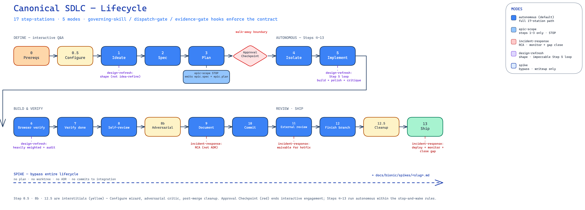
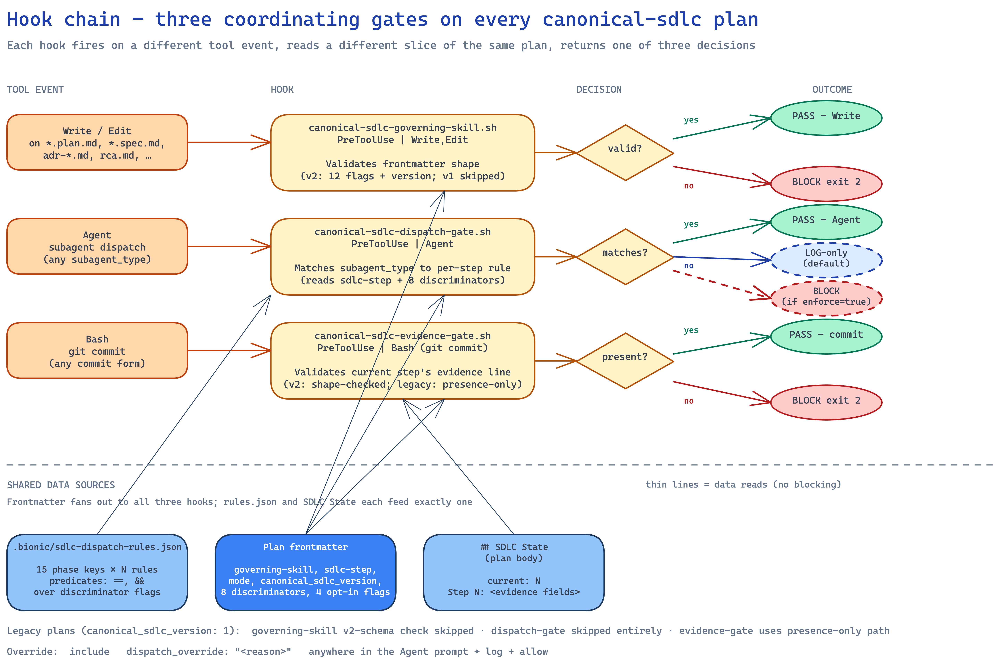

# Canonical SDLC

Bionic's flagship engineering pattern: a 14-step autonomous software development lifecycle that runs unattended for hours and produces an auditable record at the end.

This is the human-facing reference. The skill prose Claude reads at runtime is in [`SKILL.md`](SKILL.md) — same directory.

> **TL;DR.** A skill enforces 14 steps + three interstitials (Step 0.5 Configure, Step 8b Adversarial critic, Step 12.5 Cleanup). Three hooks back the skill: `governing-skill` validates plan frontmatter, `dispatch-gate` routes Agent calls per step, `evidence-gate` blocks commits without evidence. Plan frontmatter is single source of truth — `mode`, `sdlc-step`, eight discriminator flags, four opt-in flags. Five modes: `autonomous` (default), `epic-scope`, `incident-response`, `design-refresh`, `spike`. Configurable via `sdlc-dispatch-rules.json`; overridable per-call via `dispatch_override` strings. The whole loop is opt-in scaffolding designed to be calibrated and partially retired.

---

## Contents

- [Why this exists](#why-this-exists)
- [A real plan walkthrough](#a-real-plan-walkthrough)
- [Diagrams](#diagrams)
- [Configuration deep-dive](#configuration-deep-dive)
- [Mode comparison](#mode-comparison)
- [Comparison vs alternatives](#comparison-vs-alternatives)
- [Audit log walkthrough](#audit-log-walkthrough)
- [Pointers](#pointers)

---

## Why this exists

Most "AI does the SDLC" demos collapse the lifecycle: a brainstorm becomes code in one shot, with the spec implied, the plan unwritten, the review skipped, the audit trail missing. That works on toy problems and fails on anything wave-sized — multi-day work that touches multiple files, ships to users, and accumulates decisions a future maintainer needs.

Canonical SDLC is the constraint that forces the lifecycle to stay intact. Each of the 14 steps contributes a dimension of fidelity — scope, contract, plan, isolation, proof, review, decision record, release discipline — that no other step supplies. Without enforcement, individual steps feel skippable in isolation, but the compounding loss of fidelity is invisible mid-effort and surfaces later as rework.

The skill plus three hooks make the lifecycle non-skippable. The plan file is the single source of truth: state lives in YAML frontmatter, evidence lives in the `## SDLC State` section, and decisions live in ADRs (or RCAs for incidents). Every commit must show evidence for the current step. Every Agent dispatch must match the routing rule for the current step. Every plan/spec/ADR must declare the skill that produced it.

The autonomous span is **Steps 4–13** — Claude walks away to build for hours and returns with merged code. Steps 1–3 (Ideate, Spec, Plan) are interactive: that's where wrong assumptions get caught cheaply. Step 3 ends with an explicit user approval before autonomous execution begins.

---

## A real plan walkthrough

This is the shape of an actual canonical-sdlc plan. The example is invented — a hypothetical "add rate-limiting to the auth API" wave — but every line matches the real schema and would pass the actual hooks.

### The plan file

`docs/bionic/plans/epic-04-auth-hardening/wave-02-rate-limit.plan.md`:

```markdown
---
governing-skill: superpowers:writing-plans
sdlc-step: 5
canonical_sdlc_version: 2
mode: autonomous
epic: epic-04-auth-hardening
wave: wave-02-rate-limit

# Discriminators (drive dispatch routing)
surface_type: api
language: typescript
perf_critical: false
security_boundary: true
distributed: false
has_ui: false
multi_agent: false
deploy_target: vercel

# v2 opt-in flags
narrative_verbose: false
dispatch_enforce: false
cleanup_on_finish: true
archived: false

# Audit
created: 2026-05-03
cleaned: null
evidence_schema: v2
---

# Wave 2 — Token-bucket rate limit on /auth/login

## SDLC State
mode: autonomous
integration-branch: main
current: 5

Step 0: prereqs: ok
Step 0.5: configured at 2026-05-03T14:22Z via "set security_boundary=true, set deploy_target=vercel, confirm"
Step 1: docs/bionic/specs/epic-04-auth-hardening/wave-02-rate-limit.spec.md#phase-1
Step 2: docs/bionic/specs/epic-04-auth-hardening/wave-02-rate-limit.spec.md#phase-2
Step 3: #plan-body
Step 4:
  worktree: .worktrees/wave-02-rate-limit
  base-sha: a1b2c3d
  branch: wave-02-rate-limit
Step 5: (pending)
Step 6: (pending)
Step 7: (pending)
Step 8: (pending)
Step 8b: (pending)
Step 9: (pending)
Step 10: (pending)
Step 11: (pending)
Step 12: (pending)
Step 12.5: (pending)
Step 13: (pending)

## Assumptions
- Token bucket sized for 5 logins/min/IP — matches existing /auth/signup limit
- Redis already provisioned for session storage; reuse for rate-limit counters
- Failure mode on Redis outage: fail open (log warning), not fail closed (block all logins)

## Plan body
... ordered step list, critical files list ...
```

The frontmatter declares everything that drives behavior. The `## SDLC State` section records evidence as steps progress — `(pending)` placeholders are blocked from commit by the evidence-gate hook, so each step's line is updated **before** the commit lands.

### What each hook checks at each step

| Step transition | Tool call that fires | Hook | What gets validated |
|---|---|---|---|
| Plan write at Step 3 | `Write` of `wave-02-rate-limit.plan.md` | `governing-skill` | Frontmatter has `governing-skill: superpowers:writing-plans`, `mode: autonomous`, all 4 v2 opt-in flags, all 8 discriminator flags |
| Step 5 specialist dispatch | `Agent` with `subagent_type: voltagent-lang:typescript-pro` | `dispatch-gate` | Rule for Step 5 + `language == 'typescript'` matches `voltagent-lang:typescript-pro` → pass (or log-only if `dispatch_enforce: false`) |
| Step 7 commit | `Bash` running `git commit -m "test: rate-limit suite passes 47/47"` | `evidence-gate` | Plan's `## SDLC State` `Step 7:` block has `cmd:`, `pass: 47`, `total: 47`, `output: ...`; `pass == total` |
| Step 8 review dispatch | `Agent` with `subagents: [code-reviewer, security-auditor]` parallel | `dispatch-gate` | `security_boundary == true` matched → expect security-auditor in the parallel set |
| Step 8b adversarial | `Agent` with `subagent_type: voltagent-qa-sec:penetration-tester` | `dispatch-gate` | Step 8b + `security_boundary == true` → matches penetration-tester rule |
| Step 13 ship | `Bash` running `git commit -m "feat(auth): rate-limit on login"` | `evidence-gate` | `Step 13:` block has `deploy: vercel`, `verified-at: ...`, `monitor: ...` |
| Plan write at Step 12.5 | `Write` of cleaned-up plan | `governing-skill` | Same v2 schema check, plus `cleaned: 2026-05-03` set; cleanup commit subject matches `chore(plan): post-merge cleanup of <slug>` |

The hooks compose without coordinating: governing-skill gates every plan write, dispatch-gate gates every Agent call, evidence-gate gates every git commit. Each hook reads the same plan frontmatter independently — there's no shared state between them.

### Multi-session handoff

When a session ends mid-plan (`Stop` event fires while `current < 13`), the skill writes a `## Handoff` section to the plan body before the session terminates:

```markdown
## Handoff
<!-- Always preserved regardless of narrative_verbose. Updated at session end. -->

### Resume point
step: 5
sub-task: "implement Redis token-bucket adapter; tests RED at slot 3/8"
worktree: .worktrees/wave-02-rate-limit
branch: wave-02-rate-limit
last-commit: e4f5g6h
session-count: 2

### Decisions ratified this session
<!-- max 5 bullets. RESET each session. -->
- Token bucket impl uses Redis SETEX + Lua script for atomicity
- Fail-open behavior on Redis outage logged as audit event

### Tried and rejected
<!-- max 5; persists across sessions. -->
- In-memory fallback per-instance — rejected (load balancer breaks counting)

### Discovered surprises
<!-- max 5; persists across sessions. -->
- Existing /auth/signup rate-limit uses different counter shape; can't reuse adapter directly

### Open blockers
- step 6 blocked on staging Redis access (ticket OPS-441)

### Resume protocol
Read this handoff, then frontmatter, then `## SDLC State`. Continue at step 5 sub-task above. Run `bash test.sh` to confirm baseline before resuming.
```

Per-field caps total ~1300 tokens. The handoff is **rewritten in place** every session — never appended. A 3-session plan has the same handoff size as a 1-session plan. When the wave finishes single-session (or finishes a multi-session run within the resumed session), Step 12.5 cleanup strips the handoff because it's no longer needed for resume.

This is the central design move: **handoff is its own evidence tier**, structurally separated from narrative. Plans with `narrative_verbose: false` still get a full handoff when multi-session — the two flags are independent.

---

## Diagrams

### The 14-step lifecycle (with mode-keyed branches)



The autonomous mode walks all 17 stations (14 numbered steps + Step 0.5 Configure + Step 8b Adversarial critic + Step 12.5 Cleanup). The Approval Checkpoint between Step 3 and Step 4 is the "walk away" boundary — after that, Claude runs unattended through Step 13.

Mode-keyed divergences:
- **`epic-scope`** terminates after Step 3 — the output is `epic.spec.md` + `epic.plan.md` carving the work into waves; no implementation yet.
- **`incident-response`** substitutes RCA for ADR at Step 9, allows Step 11 to be waived for hotfixes (with retrospective review within 24 hours), and expands Step 13 to deploy + monitor + close monitoring gap.
- **`design-refresh`** swaps Step 1's governing skill from `idea-refine` to `shape`; Step 5 becomes a `craft → polish → critique` loop with a measurable exit gate; Step 6 is heavily weighted with audit reports.
- **`spike`** bypasses the lifecycle — output is a writeup at `docs/bionic/spikes/`. No worktree, no ADR, no commits to integration. If a spike reveals shippable work, declare a new mode and re-enter at Step 1.

### How the three hooks compose



Three independent hooks gate three different tool events. Each reads the active plan's frontmatter independently — there's no shared state. The data dependencies are asymmetric:

- **Plan frontmatter** fans out to all three hooks. Each hook reads different fields: `governing-skill` checks the schema, `dispatch-gate` reads `sdlc-step` + 8 discriminator flags, `evidence-gate` reads `evidence_schema` + `deploy_target`.
- **`sdlc-dispatch-rules.json`** feeds only `dispatch-gate`. Edits take effect on the next Agent call; the hook re-reads the file on every invocation.
- **`## SDLC State`** feeds only `evidence-gate`. The hook scans newest-mtime plans under `docs/bionic/plans/` and `docs/bionic/incidents/` to find the active one.

`governing-skill` and `evidence-gate` hard-block by default. `dispatch-gate` is **log-only by default** — mismatches are appended to `.bionic/memory/dispatch-audit.md` with a `log-only` tag but never block. Flip per-plan via `dispatch_enforce: true` to start blocking. The `dispatch_override: "<reason>"` escape hatch (any string in the Agent prompt) logs and allows regardless.

---

## Configuration deep-dive

This is the part that's most undersold by the rest of the documentation: every behavior in canonical-sdlc is configurable, and the configuration story is the reason the system can be calibrated for a specific project's reality.

### The plan frontmatter contract

Plans declare every plan-shaping flag in YAML frontmatter. Step 0.5 (the wizard) writes this; the governing-skill hook enforces presence on writes; the dispatch-gate and evidence-gate hooks read it on every invocation.

**Identity (required):**

| Field | Values | Purpose |
|---|---|---|
| `governing-skill` | A skill ID like `canonical-sdlc`, `superpowers:writing-plans`, `agent-skills:idea-refine` | Names the skill that produced the artifact. Different artifacts use different governing skills (Step 1 spec → `idea-refine`; Step 3 plan → `writing-plans`; Step 9 RCA → `canonical-sdlc`). |
| `mode` | `autonomous` (default) \| `epic-scope` \| `incident-response` \| `design-refresh` \| `spike` | Determines which steps apply, default flag values, and step substitutions. |
| `sdlc-step` | `0..13`, or `8b` | Current step. The evidence-gate hook reads this to know which step's evidence line to validate. Update **before** the commit that closes the step. |
| `canonical_sdlc_version` | `1` (legacy, grandfathered) \| `2` (current) | Routes the hooks: v1 plans take the legacy/skip path on every hook; v2 plans get full schema enforcement. |
| `epic` / `wave` / `incident` | Identifier matching the enclosing directory | Cross-reference. `epic-NN-<slug>` and `wave-NN-<slug>` for epic-tree work; `NNNN-<slug>` for incidents. |

**Discriminator flags (required for v2; drive dispatch routing):**

| Flag | Values | Drives |
|---|---|---|
| `surface_type` | `api` \| `graphql` \| `ui` \| `system` \| `realtime` \| `mobile` \| `ml` \| `iac` \| `none` | Step 2 spec specialist; Step 5 implementer; Step 8 reviewer set |
| `language` | `rust` \| `typescript` \| `javascript` \| `go` \| `python` \| `java` \| `csharp` \| `cpp` \| `php` \| `swift` \| `kotlin` \| `sql` \| `other` \| `none` | Step 5 language specialist |
| `perf_critical` | bool | Step 5 (overrides language to performance-engineer); Step 8 (adds perf-engineer to parallel review set) |
| `security_boundary` | bool | Step 8 (always includes security-auditor by default); Step 8b (routes to penetration-tester) |
| `distributed` | bool | Step 8b (routes to chaos-engineer) |
| `has_ui` | bool | Step 6 (parallel accessibility-tester + qa-expert) |
| `multi_agent` | bool | Step 3 (agent-organizer); Step 10 (git-workflow-manager) |
| `deploy_target` | `none` \| `k8s` \| `vercel` \| `custom` \| `migration` | Step 13 deploy specialist set |

**v2 opt-in flags (required for v2; per-plan rollout control):**

| Flag | Default | What it does |
|---|---|---|
| `narrative_verbose` | mode-dependent (autonomous → false; epic-scope/incident-response/design-refresh → true; spike → false) | When `false`, the skill warns on (but never blocks) narrative cruft patterns: navigation pointers, restated state, repeated `Phase N: N/A` rows, "in summary" paragraphs |
| `dispatch_enforce` | `false` (sprint-1 default) | When `false`, dispatch-gate logs mismatches without blocking. Flip to `true` once the audit log shows your rules are calibrated. |
| `cleanup_on_finish` | `false` | When `true`, Step 12.5 runs after Step 12's merge: strips narrative cruft, consolidates skipped phases, optionally archives, sets `cleaned: <date>` |
| `archived` | `false` | When `true`, Step 12.5 writes a pre-cleanup snapshot to `.bionic/evidence-archive/<date>-<slug>.md` |

**Audit:**

| Field | Purpose |
|---|---|
| `created` | Plan creation date (ISO) |
| `cleaned` | Set by Step 12.5 when cleanup runs (idempotency marker) |
| `evidence_schema` | `v2` (current shape-checked) \| `legacy` (presence-only). Drives evidence-gate enforcement path. |
| `session-count` | Incremented at session resume; reset to 1 on creation. Drives Step 12.5 handoff-fate decision. |

### Annotated `sdlc-dispatch-rules.json`

The dispatch rules are a per-step list of `{predicate, agent}` pairs. Edits take effect on the next Agent call — the hook re-reads the file fresh every invocation. No restart, no cache.

```jsonc
{
  "schema_version": 1,
  "default_behavior": "allow",                    // "allow" | "block" — fallback if no rule matches
  "audit_log": ".bionic/memory/dispatch-audit.md", // where mismatches and overrides are logged

  "phases": {                                     // 15 keys: phase_0_prereqs..phase_13_ship + phase_8b_adversarial
    "phase_5_implement": [
      // Order matters: rules evaluate top-to-bottom. First matching predicate wins.

      // Surface-type rules first — they're more specific than language rules.
      { "when": "surface_type == 'iac'",
        "agent": "voltagent-infra:terraform-engineer" },
      { "when": "surface_type == 'ml'",
        "agent": "voltagent-data-ai:ml-engineer" },

      // Compound predicate: surface AND language.
      { "when": "surface_type == 'mobile' && language == 'swift'",
        "agent": "voltagent-lang:swift-expert" },
      { "when": "surface_type == 'mobile' && language == 'kotlin'",
        "agent": "voltagent-lang:kotlin-specialist" },
      { "when": "surface_type == 'mobile'",      // fallback for mobile w/o language match
        "agent": "voltagent-core-dev:mobile-developer" },

      // Language fallbacks.
      { "when": "language == 'typescript'",
        "agent": "voltagent-lang:typescript-pro" },
      { "when": "language == 'rust'",
        "agent": "voltagent-lang:rust-engineer" },
      // ... 12 more language rules ...

      // Perf rule appears LAST among the conditional rules — listed below language so language
      // wins by default. To invert (perf wins regardless of language), move this rule above.
      { "when": "perf_critical == true",
        "agent": "voltagent-qa-sec:performance-engineer",
        "note": "Move above language rules to make perf win across all languages." },

      // Default — applied when no `when` matches. agent: null means "no specialist required".
      { "default": true, "agent": null,
        "note": "Main thread runs agent-skills:incremental-implementation." }
    ],

    "phase_8_review": [
      // Parallel rule: dispatch multiple agents in one Agent call.
      { "when": "perf_critical == true && surface_type == 'system'",
        "agents": [
          "voltagent-qa-sec:code-reviewer",
          "voltagent-qa-sec:security-auditor",
          "voltagent-qa-sec:architect-reviewer",
          "voltagent-qa-sec:performance-engineer"
        ],
        "parallel": true },

      // "always: true" rule — fires regardless of predicate values.
      // Used as a baseline that lower-priority rules can extend.
      { "always": true,
        "agents": ["voltagent-qa-sec:code-reviewer", "voltagent-qa-sec:security-auditor"],
        "parallel": true,
        "note": "Baseline 5-axis review: always run code-reviewer + security-auditor." }
    ],

    "phase_8b_adversarial": [
      { "when": "security_boundary == true",
        "agent": "voltagent-qa-sec:penetration-tester" },
      { "when": "distributed == true",
        "agent": "voltagent-qa-sec:chaos-engineer" },
      { "default": true,
        "agents": ["voltagent-qa-sec:error-detective", "voltagent-qa-sec:debugger"],
        "parallel": true,
        "note": "Default adversarial pair: failure-mode hunter + subtle-bug debugger." }
    ]
  }
}
```

Rule shapes:

| Shape | Meaning |
|---|---|
| `{ "when": "<predicate>", "agent": "<id>" }` | Single-agent dispatch when predicate matches |
| `{ "when": "<predicate>", "agents": [...], "parallel": true }` | Parallel dispatch (multiple agents in one Agent call) when predicate matches |
| `{ "always": true, "agent": "..." }` | Fires unconditionally — baseline rule |
| `{ "default": true, "agent": null }` | Fallback when no `when` matches; `null` means "no specialist required, main thread handles directly" |

### Predicate grammar

Implemented in v1:

| Form | Example |
|---|---|
| Equality with string | `surface_type == 'api'` |
| Equality with bool | `perf_critical == true` |
| Conjunction | `surface_type == 'mobile' && language == 'swift'` |

Reserved for future use:

| Form | Example | Status |
|---|---|---|
| Set membership | `language in ['rust', 'go', 'cpp']` | Deferred |
| Negation | `!has_ui` | Deferred |
| Disjunction | `\|\|` | Deferred (use multiple rules instead) |

### How to add a new specialty

Suppose the codebase grows a Solidity contract surface and you want Step 5 to dispatch to a Solidity specialist when `language == 'solidity'`. Three changes:

1. **Add the value to the discriminator's allowed set.** Edit `skills/canonical-sdlc/SKILL.md`'s `language` row in the Step 0.5 inference table to include `solidity` (so the wizard accepts it as an override value).
2. **Add the rule.** Insert into `phase_5_implement` above the language fallbacks:
   ```json
   { "when": "language == 'solidity'",
     "agent": "voltagent-lang:solidity-pro" }
   ```
3. **Re-run the wave.** No bootstrap, no restart. The dispatch-gate hook re-reads the JSON on every Agent call.

If the agent doesn't exist yet, set `"agent": null` to let the main thread handle Step 5 directly until you author one.

### How to override for one plan

Two override mechanisms:

**Per-Agent-call override (the escape hatch).** Include `dispatch_override: "<one-line reason>"` anywhere in the Agent prompt. The dispatch-gate hook detects it, logs the call to `dispatch-audit.md` with an `override` tag, and allows regardless of the matched rule. Use when:
- The rule is wrong for this specific case (e.g., a typescript file that's actually performance-critical bytecode generation — the typescript-pro rule fires but you want the rust-engineer instead because the algorithm is the same).
- A specialist isn't available for this language/surface combination.
- You're prototyping a new dispatch pattern and want to log it without modifying the rules JSON yet.

**Per-plan flag flip.** Set `dispatch_enforce: false` in the plan frontmatter and the hook is log-only for the entire plan. Useful for new plans where you don't yet know the rules are calibrated.

### How to flip a flag default after calibration

The four v2 opt-in flags exist to give per-plan rollout control. Once a flag has been exercised across enough plans to establish that the new behavior is correct, the default flips. The retirement sequence (per [ADR-004](../../docs/bionic/adrs/canonical-sdlc-v2/) — local-only):

1. **Calibration phase** — 2–3 plans complete cleanly with the flag in its non-default position. Check `dispatch-audit.md` for mismatches; review and categorize each.
2. **Default flip** — change the inferred default in the Step 0.5 wizard (in `SKILL.md`'s mode-defaults table). New plans get the new default; existing plans are unaffected.
3. **Soak period** — 30+ days with no override usage on the flag.
4. **Retirement** — hard-code the value into the skill, remove the flag from frontmatter and the wizard. The plan schema shrinks.

The flags are scaffolding designed to be partially retired. The end state for each flag is: hard-coded behavior (retired) or permanent configuration (kept). Not all flags will retire on the same timeline.

### Migrating in-flight plans

When canonical-sdlc v2 first deploys via `./claude-bootstrap.sh`, every existing plan in your project's `docs/bionic/plans/` (and `docs/superpowers/plans/`, `~/.claude/plans/`, etc.) needs `canonical_sdlc_version: 1` added to its frontmatter — otherwise the new strict governing-skill hook blocks the next `Write`/`Edit` because the version field is missing.

The migration script handles this:

```bash
# Per-file:
bash ~/.claude/skills/canonical-sdlc/migrate-frontmatter.sh path/to/plan.md

# Sweep an entire directory:
find docs/bionic/plans -type f -name '*.md' \
  -exec bash ~/.claude/skills/canonical-sdlc/migrate-frontmatter.sh {} \;
```

The script is idempotent — re-running on an already-migrated file is a no-op. It adds three fields if missing: `canonical_sdlc_version: 1`, `evidence_schema: legacy`, `created: <today>`. It only operates on files matching the canonical-sdlc artifact patterns (`*.plan.md`, `*.spec.md`, `adr-*.md`, `continuation*.md`); other files are silently skipped.

Migrated plans run under v1 grandfathering forever (or until you choose to manually rewrite to v2 schema). The hook chain treats them as legacy: governing-skill checks only the `governing-skill:` field; dispatch-gate skips entirely; evidence-gate uses the pre-redesign presence-only path.

---

## Mode comparison

The five modes determine which steps apply and how each step is governed. Most differences cluster at Steps 1, 5, 9, 11, 13.

| Step | `autonomous` (default) | `epic-scope` | `incident-response` | `design-refresh` | `spike` |
|---|---|---|---|---|---|
| 0. Prereqs | ✓ | ✓ | ✓ | ✓ | ✓ |
| 0.5. Configure | ✓ required | ✓ required | ✓ required | ✓ required | ✓ lightweight |
| 1. Ideate | `idea-refine` (interactive Q&A) | `idea-refine` (interactive Q&A) | `idea-refine` compressed → triage | `shape` (design brief) | woven `source-driven-development` |
| 2. Spec | testable contract | `epic.spec.md` | `spec.md`: repro + closure criteria | visual acceptance criteria | — |
| 3. Plan | `epic-NN-<slug>/wave-NN-<slug>.plan.md` | `epic.plan.md` (carves waves) | incident `plan.md` | wave `.plan.md` | — |
| **3 → 4** | **Approval Checkpoint (walk-away boundary)** | terminates here | Approval Checkpoint | Approval Checkpoint | — |
| 4. Isolate | worktree off integration branch | N/A | worktree off integration branch | worktree off integration branch | scratch branch / uncommitted |
| 5. Implement | `incremental-implementation` + TDD | N/A | systematic-debugging → fix; failing test = repro | `impeccable` `craft → polish → critique` loop | informal research |
| 6. Browser verify | UI flows or N/A | N/A | UI flows or N/A | heavily weighted; per-state evidence + `audit` | — |
| 7. Verify done | `verification-before-completion` | N/A | `verification-before-completion` | `verification-before-completion` | — |
| 8. Self-review | 5-axis review | N/A | 5-axis | 5 code axes only | — |
| 8b. Adversarial critic | **mandatory** | N/A | mandatory; framed for "fix masks deeper issue" | mandatory; framed for visual regressions + a11y | optional |
| 9. Document | ADR | N/A | **RCA (not ADR)** | ADR | — |
| 10. Commit | per-step checkpoint | N/A | per-step checkpoint | per-step checkpoint | no commits to integration |
| 11. External review | required | N/A | **waivable** for hotfix; retro within 24h | required | — |
| 12. Finish branch | merge to integration | N/A | merge | merge | — |
| 12.5. Cleanup | opt-in via `cleanup_on_finish` | N/A | opt-in | opt-in | — |
| 13. Ship | checklist + rollback + `continuation.md` | N/A | deploy + monitor + close gap | + optional `extract` for design-system patterns | writeup at `docs/bionic/spikes/` |

Default flag values per mode:

| Mode | `narrative_verbose` | `dispatch_enforce` | `cleanup_on_finish` | Step 8b mandatory? |
|---|---|---|---|---|
| `autonomous` | `false` | `false` (sprint-1) | `false` | yes |
| `epic-scope` | `true` | `false` | `false` | N/A (no code) |
| `incident-response` | `true` | `false` | `false` | yes |
| `design-refresh` | `true` | `false` | `false` | yes |
| `spike` | `false` | `false` | `false` | optional |

Mode declaration is reviewable. A wave-sized feature disguised as a `spike` to skip the lifecycle is drift with a label; the declaration must match the actual work.

---

## Comparison vs alternatives

|  | Canonical SDLC | superpowers SDLC | Raw `agent-skills` | No skill |
|---|---|---|---|---|
| **Lifecycle enforcement** | 14 steps + 3 interstitials, hook-enforced | 7 skills, soft chained | None — content rubrics only | None |
| **State persistence** | Plan frontmatter + `## SDLC State` + `## Handoff` | Plan files; no state schema | None | None |
| **Audit trail** | Per-step checkpoint commits + dispatch-audit.md + ADRs | Optional; at user discretion | None | None |
| **Multi-session resume** | `## Handoff` schema + `continuation.md` | Manual | Manual | Manual |
| **Configurability** | `sdlc-dispatch-rules.json` per-step rules + 12 plan flags | None | None | N/A |
| **Mode polymorphism** | 5 modes (autonomous, epic-scope, incident-response, design-refresh, spike) | None | None | N/A |
| **External enforcement** | 3 hooks (governing-skill, dispatch-gate, evidence-gate) | None | None | None |
| **Cost** | ~5–15 commits per wave; 12 frontmatter fields; one rules JSON to maintain | Lighter; no audit trail | None — picked à la carte | None |
| **When to use** | Wave-sized work that ships to users; epics; production incidents; design refreshes | One-off changes; small features | Specific content needs (5-axis review, 6-lens ideation) | Throwaway scripts, exploration |

The three are not mutually exclusive. `canonical-sdlc` calls into both `superpowers:` and `agent-skills:` skills for individual steps — `superpowers:writing-plans` governs Step 3, `agent-skills:idea-refine` governs Step 1, etc. The flagship pattern is the *enforcement shell*, not a replacement for either plugin.

For one-off changes (typo fix, single-file refactor), use `superpowers:writing-plans` directly without invoking canonical-sdlc — the audit trail isn't worth the overhead.

---

## Audit log walkthrough

Every dispatch-gate decision writes to `.bionic/memory/dispatch-audit.md`. After a few waves, the file accumulates entries that surface where the rules JSON is wrong, where flags are missing, and where overrides recur. The file is the input to flag retirement and rule calibration.

### Entry shapes

`dispatch-audit.md` accumulates three entry types. Each is a single-line record with a tag indicating which path was taken.

```markdown
# Dispatch Audit Log
<!-- Appended by canonical-sdlc-dispatch-gate.sh on every Agent tool call. -->

[2026-05-03T14:31:02Z] log-only-single
  plan: docs/bionic/plans/epic-04-auth-hardening/wave-02-rate-limit.plan.md
  step: 5
  predicate: language == 'typescript'
  expected: voltagent-lang:typescript-pro
  got: voltagent-lang:typescript-pro
  result: match

[2026-05-03T14:42:18Z] log-only-parallel
  plan: docs/bionic/plans/epic-04-auth-hardening/wave-02-rate-limit.plan.md
  step: 8
  predicate: security_boundary == true
  expected: [voltagent-qa-sec:code-reviewer, voltagent-qa-sec:security-auditor]
  got: [voltagent-qa-sec:code-reviewer, voltagent-qa-sec:security-auditor]
  result: match

[2026-05-03T15:08:55Z] mismatch
  plan: docs/bionic/plans/epic-04-auth-hardening/wave-02-rate-limit.plan.md
  step: 5
  predicate: language == 'typescript'
  expected: voltagent-lang:typescript-pro
  got: voltagent-lang:rust-engineer
  result: mismatch (allowed because dispatch_enforce=false)

[2026-05-03T15:11:09Z] override
  plan: docs/bionic/plans/epic-04-auth-hardening/wave-02-rate-limit.plan.md
  step: 5
  override: "rust-engineer is the right specialist for this perf-critical TS — algorithm is the same"
  expected: voltagent-lang:typescript-pro
  got: voltagent-lang:rust-engineer
  result: override (allowed)
```

### Tag glossary

| Tag | Meaning | What it tells you |
|---|---|---|
| `log-only-single` | `dispatch_enforce: false` + matched single-agent rule + correct subagent | Rule is calibrated; nothing to do. |
| `log-only-parallel` | `dispatch_enforce: false` + matched parallel rule + correct subagent set | Rule is calibrated. |
| `mismatch` | Rule matched but Agent call used a different subagent | Either the rule is wrong (intent ≠ rule), the user knows better (override should have been used), or the call was authentic — inspect. |
| `override` | `dispatch_override: "..."` was present in the prompt | The override reason is logged; review for recurring patterns. Recurring overrides on the same expected→got pair = missing rule. |
| `block` | `dispatch_enforce: true` + mismatch + no override | The hook blocked the Agent call. The plan halts until the user provides direction. |

### The calibration loop

The first sprint of canonical-sdlc adoption is a calibration loop, not a finishing line. The expectation:

**Weekly (sprint-1).** Open `dispatch-audit.md`; review every `mismatch` and `override` entry. For each:
- **Recurring same-step mismatch with the same expected→got pair** → the rule is wrong. Update `sdlc-dispatch-rules.json`.
- **Recurring override with the same reason** → either a rule is missing (add it) or a discriminator is missing (add a new flag).
- **One-off override with a domain-specific reason** → leave it; the override mechanism exists exactly for this.
- **Mismatch where you wish the agent had been blocked** → the rule is right; you want to flip `dispatch_enforce: true` for this plan or globally.

**Monthly (post-sprint-1).** Same review, less frequently. Look for entries that haven't appeared in 30+ days — those signal a flag whose default is now safe to flip.

### Flag retirement decisions

After 2–3 plans complete cleanly with a flag in its non-default position, consider flipping the default. The signal isn't "no audit entries" — it's "no surprising audit entries." Specifically:

- `dispatch_enforce: true` is safe to default after the audit log shows zero `mismatch` entries that the user didn't want blocked, across 2–3 plans.
- `narrative_verbose: false` is safe to default for `autonomous` mode after Step 12.5 cleanups show the verification + handoff tiers preserve everything important and the narrative tier was strippable cleanly.
- `cleanup_on_finish: true` is safe to default after the 9-step cleanup procedure has been exercised on 2–3 plans without the user wanting to revert any cleanup.
- `archived: true` is safe to default once the archive directory has accumulated cleanly (no per-archive review needed).

When all four flags have flipped and 30+ days pass with no override usage, the flags become candidates for retirement (hard-coded into the skill, removed from the wizard, removed from the frontmatter schema). The end-state plan schema is smaller than today's.

The empirical arm of the redesign — picking a wave-sized feature, running with all four flags in their non-default positions, watching the audit log accumulate, calibrating, deciding which flags to flip — is the calibration work that turns this from opt-in scaffolding into a refined default.

---

## Pointers

| Resource | Path |
|---|---|
| Skill prose (Claude reads at runtime) | [`SKILL.md`](SKILL.md) |
| Per-step dispatch rules (template) | [`sdlc-dispatch-rules.json`](sdlc-dispatch-rules.json) |
| Migration script (legacy → v1-grandfathered) | [`migrate-frontmatter.sh`](migrate-frontmatter.sh) |
| Lifecycle diagram source | [`diagrams/lifecycle.excalidraw`](diagrams/lifecycle.excalidraw) |
| Hook-chain diagram source | [`diagrams/hook-chain.excalidraw`](diagrams/hook-chain.excalidraw) |
| Hooks (in-tree source) | [`hooks/canonical-sdlc-evidence-gate.sh`](../../hooks/canonical-sdlc-evidence-gate.sh), [`canonical-sdlc-governing-skill.sh`](../../hooks/canonical-sdlc-governing-skill.sh), [`canonical-sdlc-dispatch-gate.sh`](../../hooks/canonical-sdlc-dispatch-gate.sh) |
| Per-project rules JSON (deployed by bootstrap) | `<project>/.bionic/sdlc-dispatch-rules.json` |
| Audit log (auto-created on first append) | `<project>/.bionic/memory/dispatch-audit.md` |
