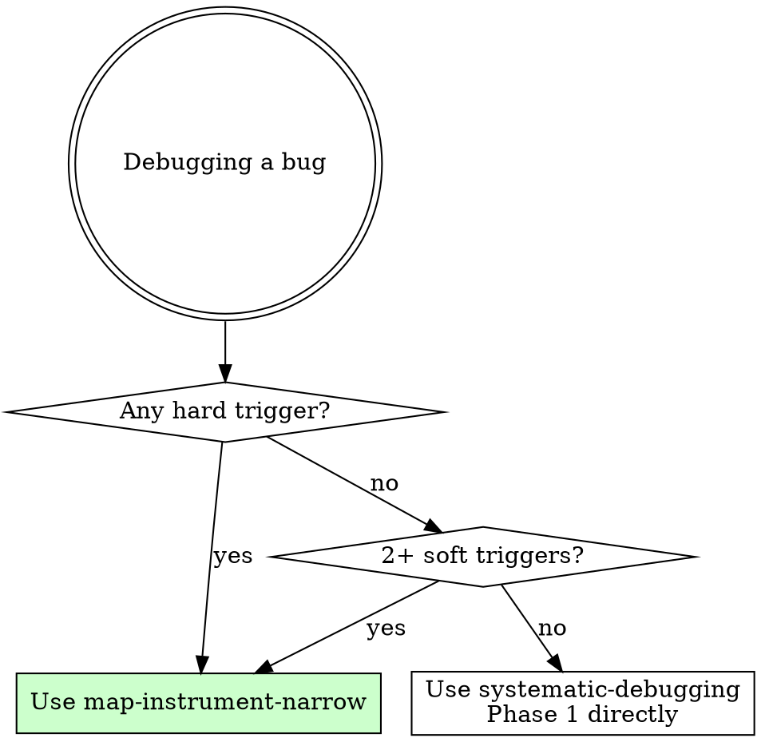

# Map-Instrument-Narrow

## Overview

Observation technique for debugging complex systems. Three phases produce a data-confirmed root cause before any fix code is written.

**Core principle:** Research makes data interpretable. Data makes fixes obvious. Without the research, you can't read the numbers. Without the numbers, you're guessing.

**Violating the letter of this process is violating the spirit of this process.**

**Layer:** Technique (observation constraint). Invoked inside `systematic-debugging`'s Phase 1 "Gather Evidence" or `ralph-loop`'s DIAGNOSE phase when hard/soft triggers are met. It does not replace the scientific method — it provides the observation capability that feeds it.

## The Iron Law

```
NO FIX CODE WITHOUT DATA. NO INSTRUMENTATION WITHOUT ARCHITECTURE.
```

## When to Use



**Hard triggers (any one):**
- Prior fix attempt failed without clear understanding of why
- Bug involves async/deferred execution (rAF, setTimeout, Promise chains, event listeners)
- Root cause spans code you don't own (third-party library internals)

**Soft triggers (two or more):**
- State is correct at point A but wrong at point B with no visible code path connecting them
- A "fix" works in isolation but gets overridden by something else
- Multiple interacting subsystems (3+ layers)
- Prior session attempted fixes without measurement data

## Phase 1: MAP

**Goal:** Build architectural understanding so instrumentation data will be interpretable.

**Dispatch parallel research agents:**

| Agent | Role | Deliverable |
|-------|------|-------------|
| **Architect** | Read source code of the system under investigation — your code AND library internals | Written analysis: call chains, async boundaries, state ownership |
| **Git** | Assess current state — dirty files, recent changes, what's committed vs experimental | Categorized file list: keep vs experimental vs mixed |
| **Env** | Verify infrastructure readiness — services running, build state, test tooling | Readiness report with blockers |

**The architect agent is the critical one.** It reads the library source to find things like:
- `render()` uses `requestAnimationFrame` (deferred, not synchronous)
- `setCameraCPU()` reads `ImagePositionPatient` and modifies translation
- `_updateToDisplayImageCPU()` replaces the viewport object

Without this, instrumentation data is numbers without meaning.

**Phase 1 produces:** A written architectural artifact. "I have a mental model" is not evidence. Write it down.

**MAP phase is complete when:** You can describe the full call chain from trigger to symptom, including async boundaries and state ownership at each step.

## Phase 2: INSTRUMENT (Broad Capture)

**Goal:** Capture the full state picture. Answer "what IS happening?" not "why?"

**Add diagnostic logging at key state boundaries:**
- State BEFORE the operation
- State AFTER the operation
- Confirmation that fix/guard code executes
- State at the symptom point (e.g., render time)

```typescript
// Example: broad capture at operation boundaries
console.warn(`[DIAG] PRE operation: state=${JSON.stringify(relevant_state)}`);
await theOperation();
console.warn(`[DIAG] POST operation: state=${JSON.stringify(relevant_state)}`);
```

**Run the test scenario. READ THE NUMBERS. Do not form hypotheses yet.**

The broad capture answers:
- Does the system enter the expected code path?
- Is the state correct before the operation?
- Does the operation change state as expected?
- Is the state still correct at the symptom point?

**Phase 2 produces:** Raw diagnostic data showing the state at each boundary. The GAP — where state goes from correct to incorrect — should be visible.

**INSTRUMENT phase is complete when:** You can point to two adjacent diagnostic points where state is correct at one and incorrect at the other.

## Phase 3: NARROW (Targeted Per-Call)

**Goal:** Find the exact mutation point within the gap identified in Phase 2.

**Add per-call logging between the two boundary points:**

```typescript
// Example: narrow within setRenderParams
operationA();
console.warn(`[DIAG] AFTER-A: state=${readState()}`);

operationB();
console.warn(`[DIAG] AFTER-B: state=${readState()}`);

operationC();
console.warn(`[DIAG] AFTER-C: state=${readState()}`);
```

**Run the test scenario. The data identifies the single culprit.**

If AFTER-A shows correct state and AFTER-B shows incorrect state, the mutation is inside operationB. The fix is now obvious — it's informed by data, not guesswork.

**Phase 3 produces:** A definitive root cause statement with data evidence: "operationB mutates state from X to Y because [mechanism from MAP phase]."

**NARROW phase is complete when:** You can name the single function/call that causes the mutation AND explain WHY (using the architectural understanding from MAP).

## Constraints

- **No fix code during MAP or INSTRUMENT.** You are observing, not treating.
- **No fix code during NARROW** until the data names a single culprit.
- **Each phase produces a written artifact.** Architecture analysis, diagnostic data, root cause statement.
- **Instrumentation is disposable.** Remove or commit separately from the fix. Never ship diagnostic logging unless explicitly asked.
- **One test run per phase.** Broad capture = one run. Targeted narrowing = one run. If you need more than two test runs to find root cause, your MAP phase was incomplete — go back and research more.

## Common Rationalizations

| Excuse | Reality |
|--------|---------|
| "I can see the bug, let me just fix it" | Session 24 "saw" the bug 4 times. All fixes failed. MAP first. |
| "Instrumentation is overkill for this" | 5 console.warn lines found the root cause in 3 minutes. |
| "I don't need to read the library source" | The bug was IN the library's internal call chain. You can't instrument what you don't understand. |
| "I'll instrument after I try one thing" | That "one thing" changes state. Now your instrumentation captures post-fix state, not the original bug. |
| "I have a good mental model" | Mental models die with context. The architect agent's WRITTEN analysis survived and made data readable. |
| "The broad capture is enough" | Broad capture shows WHERE the gap is. NARROW shows WHAT fills it. Both are needed. |

## Red Flags — STOP and Return to MAP

- Writing fix code before NARROW phase completes
- Instrumenting without understanding the call chain (numbers without meaning)
- Skipping the architect agent ("I know this codebase")
- Forming hypotheses during INSTRUMENT phase (observe first, theorize later)
- More than 2 test runs without a root cause (incomplete MAP)

## Quick Reference

| Phase | Input | Action | Output |
|-------|-------|--------|--------|
| **MAP** | Bug report + codebase | Parallel research agents | Written architecture artifact |
| **INSTRUMENT** | Architecture understanding | Broad state logging at boundaries | Diagnostic data showing the gap |
| **NARROW** | The gap (correct → incorrect) | Per-call logging within the gap | Single culprit with evidence |
| **→ Fix** | Root cause + evidence | One atomic code change | Verified via test run |

## Real-World Impact

**Without MAP-INSTRUMENT-NARROW (Session 24):**
- 4 fix attempts, all failed
- No data, pure guesswork
- Each fix created new unknowns
- Hours spent, zero progress

**With MAP-INSTRUMENT-NARROW (Session 25):**
- Architect agent found `requestAnimationFrame` deferral in 6 minutes
- Broad capture identified the gap (FIX → RENDER) in one test run
- Per-call narrowing named `setPan()` as culprit in one test run
- Fix was 2 lines, worked first attempt
- Total: ~1 hour from start to verified fix
