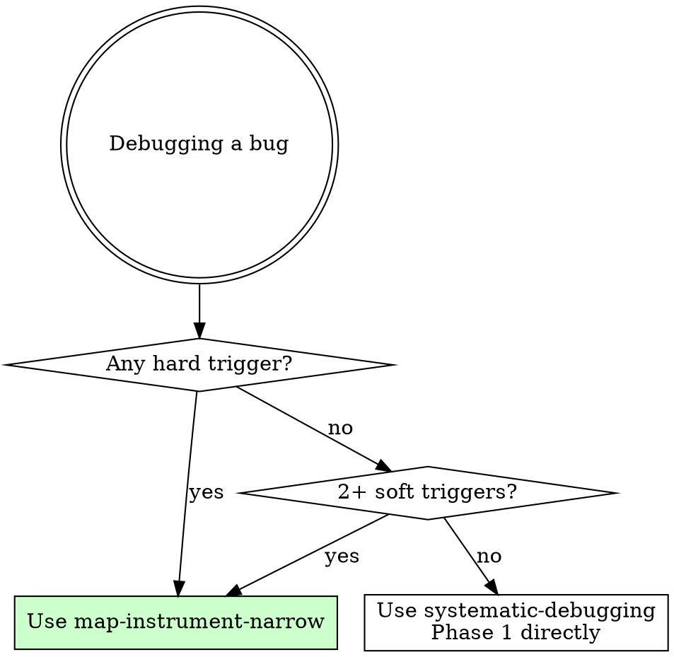

# Map-Instrument-Narrow

## Overview

Observation technique for debugging complex systems. Three phases produce a data-confirmed root cause before any fix code is written.

**Core principle:** Research makes data interpretable. Data makes fixes obvious. Without the research, you can't read the numbers. Without the numbers, you're guessing.

**Violating the letter of this process is violating the spirit of this process.**

**Layer:** Technique (observation constraint). Invoked inside `systematic-debugging`'s Phase 1 "Gather Evidence" or `ralph-loop`'s DIAGNOSE phase when hard/soft triggers are met. It does not replace the scientific method — it provides the observation capability that feeds it.

## Invocation

This skill is invoked **proactively, not reactively**. Two canonical entry paths:

1. **Autonomous-mode bridge.** `canonical-sdlc`'s Autonomous Friction Protocol loads this skill on the FIRST diagnostic friction event — not after a speculative fix has failed. If you are debugging inside an autonomous wave and this skill has not been loaded, STOP and load it before any fix code.
2. **Hard-trigger match.** Any one of the hard triggers below (async/third-party/prior-fix-failed) invokes this skill directly, regardless of mode.

If you find yourself writing fix code *before* this skill has been loaded in either path, you are violating the protocol. This is the single highest-cost debugging pattern.

## The Iron Law

```
NO FIX CODE WITHOUT DATA. NO INSTRUMENTATION WITHOUT ARCHITECTURE.
```

## Rigor Mandate

This is the directive that makes the technique work. When this skill is invoked — especially by an orchestrator dispatching a subagent — run under it **verbatim**:

> **Execute map-instrument-narrow with exquisite rigor and discipline. Absolutely no corner-cutting.** Walk every phase gate in order — MAP → INSTRUMENT → NARROW — and write each phase's artifact before advancing past its gate. No fix code, and no "let me just try one thing first." No ad-hoc, trial-and-error theory-hopping: the data names the root cause, not your hunches. NO FIX CODE WITHOUT DATA. NO INSTRUMENTATION WITHOUT ARCHITECTURE.

**Why this is non-negotiable.** The dominant failure mode is not ignorance of the method — it is *abandoning it under pressure*: spinning through hypotheses, patching the first plausible theory, declaring victory before the data names a single culprit. That ad-hoc whack-a-mole is exactly what this technique exists to replace. Held to the discipline above, the technique reliably finds the true root cause; the rigor **is** the value, not an overhead on it.

This directive is the canonical source. Orchestrators (e.g. `canonical-sdlc`) MUST inject it verbatim into every diagnostic-friction subagent prompt — see that skill's **Subagent Dispatch Convention** (point 8) and `.bionic/sdlc-dispatch-rules.json` (`diagnostic_friction.directive`).

## When to Use


```dot
digraph trigger {
    "Debugging a bug" [shape=doublecircle];
    "Any hard trigger?" [shape=diamond];
    "Use map-instrument-narrow" [shape=box, style=filled, fillcolor="#ccffcc"];
    "2+ soft triggers?" [shape=diamond];
    "Use systematic-debugging\nPhase 1 directly" [shape=box];

    "Debugging a bug" -> "Any hard trigger?";
    "Any hard trigger?" -> "Use map-instrument-narrow" [label="yes"];
    "Any hard trigger?" -> "2+ soft triggers?" [label="no"];
    "2+ soft triggers?" -> "Use map-instrument-narrow" [label="yes"];
    "2+ soft triggers?" -> "Use systematic-debugging\nPhase 1 directly" [label="no"];
}
```

**Hard triggers (any one):**
- Prior fix attempt failed without clear understanding of why
- Bug involves async/deferred execution (rAF, setTimeout, Promise chains, event listeners)
- Root cause spans code you don't own (third-party library internals)

**Soft triggers (two or more):**
- State is correct at point A but wrong at point B with no visible code path connecting them
- A "fix" works in isolation but gets overridden by something else
- Multiple interacting subsystems (3+ layers)
- Prior session attempted fixes without measurement data

## Phase 1: MAP

**Goal:** Build architectural understanding so instrumentation data will be interpretable.

**Dispatch parallel research agents:**

| Agent | Role | Deliverable |
|-------|------|-------------|
| **Architect** | Read source code of the system under investigation — your code AND library internals | Written analysis: call chains, async boundaries, state ownership |
| **Git** | Assess current state — dirty files, recent changes, what's committed vs experimental | Categorized file list: keep vs experimental vs mixed |
| **Env** | Verify infrastructure readiness — services running, build state, test tooling | Readiness report with blockers |
| **State-Audit** | Verify inherited claims (handoff docs, prior agent assertions, checkpoint files, "95% done" claims) against actual repo state | Discrepancy list with evidence — what was claimed vs what is true now |

**The architect agent is the critical one.** It reads the library source to find things like:
- `render()` uses `requestAnimationFrame` (deferred, not synchronous)
- `setCameraCPU()` reads `ImagePositionPatient` and modifies translation
- `_updateToDisplayImageCPU()` replaces the viewport object

Without this, instrumentation data is numbers without meaning.

**Phase 1 produces:** A written architectural artifact. "I have a mental model" is not evidence. Write it down.

**MAP phase is complete when:** You can describe the full call chain from trigger to symptom, including async boundaries and state ownership at each step.

## Phase 2: INSTRUMENT (Broad Capture)

**Goal:** Capture the full state picture. Answer "what IS happening?" not "why?"

**Add diagnostic logging at key state boundaries:**
- State BEFORE the operation
- State AFTER the operation
- Confirmation that fix/guard code executes
- State at the symptom point (e.g., render time)

```typescript
// Example: broad capture at operation boundaries
console.warn(`[DIAG] PRE operation: state=${JSON.stringify(relevant_state)}`);
await theOperation();
console.warn(`[DIAG] POST operation: state=${JSON.stringify(relevant_state)}`);
```

**Run the test scenario. READ THE NUMBERS. Do not form hypotheses yet.**

The broad capture answers:
- Does the system enter the expected code path?
- Is the state correct before the operation?
- Does the operation change state as expected?
- Is the state still correct at the symptom point?

**Phase 2 produces:** Raw diagnostic data showing the state at each boundary. The GAP — where state goes from correct to incorrect — should be visible.

**INSTRUMENT phase is complete when:** You can point to two adjacent diagnostic points where state is correct at one and incorrect at the other.

## Phase 3: NARROW (Targeted Per-Call)

**Goal:** Find the exact mutation point within the gap identified in Phase 2.

**Add per-call logging between the two boundary points:**

```typescript
// Example: narrow within setRenderParams
operationA();
console.warn(`[DIAG] AFTER-A: state=${readState()}`);

operationB();
console.warn(`[DIAG] AFTER-B: state=${readState()}`);

operationC();
console.warn(`[DIAG] AFTER-C: state=${readState()}`);
```

**Run the test scenario. The data identifies the single culprit.**

If AFTER-A shows correct state and AFTER-B shows incorrect state, the mutation is inside operationB. The fix is now obvious — it's informed by data, not guesswork.

**Phase 3 produces:** A definitive root cause statement with data evidence: "operationB mutates state from X to Y because [mechanism from MAP phase]."

**NARROW phase is complete when:** You can name the single function/call that causes the mutation AND explain WHY (using the architectural understanding from MAP).

## Constraints

- **No fix code during MAP or INSTRUMENT.** You are observing, not treating.
- **No fix code during NARROW** until the data names a single culprit.
- **Each phase produces a written artifact.** Architecture analysis, diagnostic data, root cause statement.
- **Instrumentation is disposable.** Remove or commit separately from the fix. Never ship diagnostic logging unless explicitly asked.
- **One test run per phase.** Broad capture = one run. Targeted narrowing = one run. If you need more than two test runs to find root cause, your MAP phase was incomplete — go back and research more.

## Common Rationalizations

| Excuse | Reality |
|--------|---------|
| "I can see the bug, let me just fix it" | Session 24 "saw" the bug 4 times. All fixes failed. MAP first. |
| "Instrumentation is overkill for this" | 5 console.warn lines found the root cause in 3 minutes. |
| "I don't need to read the library source" | The bug was IN the library's internal call chain. You can't instrument what you don't understand. |
| "I'll instrument after I try one thing" | That "one thing" changes state. Now your instrumentation captures post-fix state, not the original bug. |
| "I have a good mental model" | Mental models die with context. The architect agent's WRITTEN analysis survived and made data readable. |
| "The broad capture is enough" | Broad capture shows WHERE the gap is. NARROW shows WHAT fills it. Both are needed. |

## Phase Gates

Each phase has an explicit gate that MUST be answered before advancing. Walking past a gate is the documented dominant failure mode.

### MAP → INSTRUMENT gate

- [ ] Written architecture artifact exists (file, not "in my head")
- [ ] Async boundaries and state owners are named explicitly
- [ ] If multi-system (multiple engines / viewports / frames / runtimes): parity matrix exists showing how each system implements the relevant call chain
- [ ] Inherited claims (handoff docs, prior agent assertions, checkpoint files) verified against current repo state — discrepancies recorded

### INSTRUMENT → NARROW gate

- [ ] Probes captured at least one full scenario run
- [ ] Two adjacent boundaries show correct → incorrect transition
- [ ] No fix code has been written
- [ ] If pre-existing log volume exceeds your channel's cap (e.g., test-runner console limits) or drowns probes: existing noise has been silenced first
- [ ] If async/race: probes include monotonic timestamps + per-event sequence numbers + lifecycle events

### NARROW → FIX gate

- [ ] Single function/call identified as the mutation point
- [ ] WHY explained using MAP architecture (not just "X mutates Y" but "X mutates Y *because* the async boundary in `<location>` does Z")
- [ ] Conceptual significance written: one paragraph in plain language stating what this means for the system, whether scope changes, whether prior assumptions were wrong

### FIX → SCOPE-EXPANSION gate

If you are tempted to apply the same fix pattern to sibling callsites (other engines, other viewports, other frames), that is a **new debugging problem**, not a continuation. Re-run MAP for the sibling scope. Cross-system parity from the MAP→INSTRUMENT gate makes sibling regressions visible before they ship.

## Recursive Root-Cause Detection

One pass finds one root cause. Real defects often have **more than one**. After NARROW names a culprit, you are not done until you have asked — and answered using the architectural understanding from MAP — two questions:

1. **Is this cause itself caused by something upstream? (depth)** "The guard is missing" is proximate; "the guard was never wired because the initializer returned early" is deeper; "the initializer returned early because config loaded async" is deeper still. Each layer is a *new* root-cause investigation.
2. **Are there sibling causes the same symptom is hiding? (chain)** Fixing cause A can unmask cause B that A was masking. Two independent mutations can produce one symptom.

If the answer to either is yes, the deeper/sibling cause is a **fresh debugging problem** — it earns its own MAP-INSTRUMENT-NARROW pass, not a continuation of this one. Do not reason about it from the current, now-contaminated context (you have read fix code, mutated state, and formed theories). A fresh pass with a clean head is what keeps each layer rigorous.

### The root-cause tree

Record every cause as a node so the investigation is auditable and an orchestrator can drive the recursion:

```
{ id, statement, evidence, kind: "proximate" | "deeper" | "sibling",
  parent_id, children: [], status: "open" | "confirmed" | "fixed" }
```

- The first NARROW result is the root node (`kind: proximate`, `parent_id: null`).
- A depth finding adds a child under the current node (`kind: deeper`).
- A chain finding adds a sibling under the same parent (`kind: sibling`).
- A node is `confirmed` only when its own NARROW gate passed with data evidence.

### Who runs the recursion

- **Standalone use** (`ralph-loop`, direct invocation): when a node spawns children, run a fresh MAP-INSTRUMENT-NARROW pass for each, depth-first, and keep the tree in your working notes.
- **Under an orchestrator** (`canonical-sdlc` autonomous mode): do NOT recurse in place. Emit the confirmed node plus its open children as structured candidates and hand them back. The orchestrator owns the tree and dispatches a **fresh subagent per candidate** (clean context, same Rigor Mandate). See that skill's Autonomous Friction Protocol.

### Termination

Stop descending when a node has no upstream cause you can name from data (a **terminal** root cause), OR at `max_depth` (default 4), OR when a deeper cause expands scope beyond the current task — at which point surface the tree to the user rather than auto-recursing further. Apply a fix per confirmed node; the whole tree feeds the RCA as "root cause" + "contributing factors" / "root-cause chain."

## Quick Reference

| Phase | Input | Action | Output |
|-------|-------|--------|--------|
| **MAP** | Bug report + codebase | Parallel research agents | Written architecture artifact |
| **INSTRUMENT** | Architecture understanding | Broad state logging at boundaries | Diagnostic data showing the gap |
| **NARROW** | The gap (correct → incorrect) | Per-call logging within the gap | Single culprit with evidence |
| **→ Fix** | Root cause + evidence | One atomic code change | Verified via test run |

## Real-World Impact

**Without MAP-INSTRUMENT-NARROW (Session 24):**
- 4 fix attempts, all failed
- No data, pure guesswork
- Each fix created new unknowns
- Hours spent, zero progress

**With MAP-INSTRUMENT-NARROW (Session 25):**
- Architect agent found `requestAnimationFrame` deferral in 6 minutes
- Broad capture identified the gap (FIX → RENDER) in one test run
- Per-call narrowing named `setPan()` as culprit in one test run
- Fix was 2 lines, worked first attempt
- Total: ~1 hour from start to verified fix
