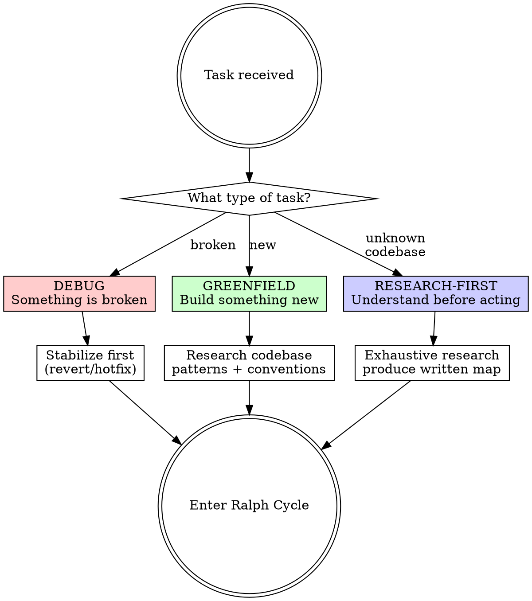
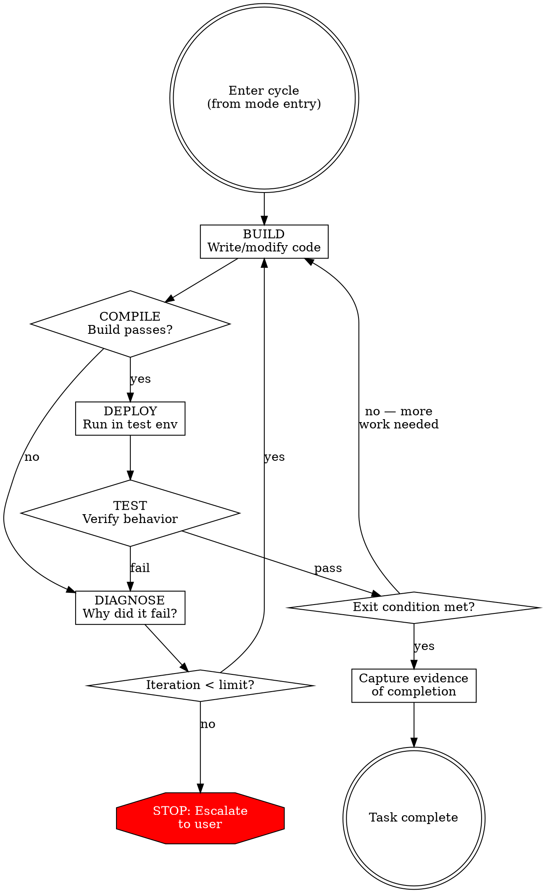

# Ralph Loop

## Overview

Working software is produced by disciplined iteration, not heroic single passes. The Ralph Loop is a build-test-diagnose cycle that runs until exit conditions are met, with mode-specific entry points for different task types.

**Core principle:** Every iteration must produce observable evidence of progress. No cycle completes without verification. No task completes without meeting its exit condition.

**Violating the letter of this process is violating the spirit of this process.**

**REQUIRED SUB-SKILLS:**
- `bionic:rigorous-refactor` — governs test discipline within each cycle
- `superpowers:systematic-debugging` — governs the diagnose phase
- `superpowers:verification-before-completion` — governs exit condition claims

## The Iron Law

```
NO ITERATION WITHOUT EVIDENCE. NO EXIT WITHOUT VERIFICATION.
```

## Mode Selection



**Choose the mode that matches the task, not the mode that's easiest.**

- **DEBUG** — Something worked before and is now broken. Entry: stabilize service first, then diagnose.
- **GREENFIELD** — Building new functionality from a spec/PRD. Entry: research existing codebase patterns, then build.
- **RESEARCH-FIRST** — Unfamiliar codebase or complex swap where understanding must precede action. Entry: exhaustive research, produce written artifact, then implement.

## Mode Entry Points

### DEBUG: Stabilize First

Before investigating root cause, answer: **Can I restore service NOW?**

1. Check if the breaking change is revertible (`git revert`, config rollback, feature flag)
2. If yes — revert, verify service restored, THEN enter the cycle to fix forward
3. If no (migrations ran, old version has CVE, etc.) — stabilize by other means (feature flag, hotfix, partial rollback), then enter the cycle

Skipped stabilization? You chose investigation over users. Fix that.

### GREENFIELD: Research Conventions

Before writing code, answer: **What patterns does this codebase use?**

1. Dispatch research subagents to map: framework, architecture, test patterns, DB conventions, existing infrastructure relevant to your feature
2. Produce a written artifact: conventions summary + component plan mapping PRD requirements to codebase patterns
3. Enter the cycle with the artifact as your guide

Started coding before the conventions artifact is complete? Stop. Delete the code. Finish the research.

### RESEARCH-FIRST: Produce a Written Map

Before planning implementation, answer: **What does the system actually do?**

1. Dispatch parallel research subagents to map every aspect of the subsystem
2. Produce a written artifact: components, data flow, integration points, assumptions, feature inventory
3. Get user alignment on the plan BEFORE entering the cycle

Started coding before the written map is complete? Stop. Delete the code. Finish the research.

## Research Phase Governance

The Iron Law applies during research too. Each research iteration must produce a written artifact (notes, maps, findings). "I have a mental model" is not evidence. Research without artifacts is unverifiable work.

## The Cycle



### BUILD — Write or modify code

One atomic change per cycle. Not three changes hoping one works.

### COMPILE — Verify it builds

If the build breaks, go straight to DIAGNOSE. Don't push through broken builds.

### DEPLOY — Run in a testable environment

Unit tests are not deployment. Run the actual application, dev server, or integration environment where behavior can be observed. If no environment exists, creating one is your first cycle.

### TEST — Verify the behavior

Follow `bionic:rigorous-refactor` for test discipline. Use a separate validator agent when verifying implementation correctness. Evidence is captured output, not "it seems to work."

### DIAGNOSE — Understand why it failed

Follow `superpowers:systematic-debugging`. Root cause before next attempt. No "let me try something else" without understanding why the last thing failed.

## Exit Conditions

| Mode | Exit Condition | Evidence Required |
|------|---------------|-------------------|
| **DEBUG** | Root cause fixed, service restored, regression test added | Captured test output + service verification |
| **GREENFIELD** | All PRD requirements implemented with passing tests | Requirement-by-requirement checklist with test evidence |
| **RESEARCH-FIRST** | Written map produced, implementation complete, all tests pass | Research artifact + captured test output |

**"Tests pass" is necessary but NOT sufficient.** The exit condition for each mode includes mode-specific verification beyond test results.

## Iteration Limits

| Mode | Limit per unit | Rationale |
|------|---------------|-----------|
| **DEBUG** | 3 cycles | If you can't fix it in 3, you don't understand it. Escalate. |
| **GREENFIELD** | 5 cycles per component | Building is iterative, but 5 failing cycles means the design is wrong. |
| **RESEARCH-FIRST** | 3 cycles per unit | Same as debug — complexity means escalate, not grind. |

After hitting the limit: STOP. Escalate with evidence of what you tried and why it failed.

## Subagent Protocol

- **Research phase:** Dispatch parallel subagents freely. Each explores one dimension.
- **Build phase:** Main thread synthesizes and decides. Subagents implement independent units.
- **Test phase:** Separate validator agent per `bionic:rigorous-refactor`. Never self-grade.
- **Diagnose phase:** Can dispatch a research subagent to investigate, but main thread forms the hypothesis.

**Coordination rule:** Before dispatching implementation subagents, define interfaces and contracts in the main thread. Subagents building against undefined interfaces produce inconsistent work.

## Common Rationalizations

| Excuse | Reality |
|--------|---------|
| "Let me just find and fix the call site" | That's skipping the cycle. Stabilize, then diagnose, then fix. |
| "I think I see the issue, let me just fix it" | Premature implementation. Research-to-build transition must be explicit. |
| "Tests pass, so it's done" | Tests pass is necessary, not sufficient. Check the exit condition for your mode. |
| "Ship the fix, harden later" | "Later" never comes. The cycle includes tests. Do it now. |
| "I can optimize later" | Skipping deploy/test verification is not optimizing. It's gambling. |
| "The bug is scoped, I don't need the full picture" | Scoped bugs have unscoped causes. Research proportional to risk, not comfort. |
| "Let me get one slice working, then replicate" | Fine — but each slice still runs the full cycle. No shortcutting the second slice. |
| "Existing tests are the contract" | Existing tests are a floor, not a ceiling. Write tests for what SHOULD work. |
| "I'll update memory/docs later" | State must be persisted each cycle. Context dies, artifacts survive. |
| "Patients can't read scans — just fix it" | Urgency means stabilize (revert) THEN fix properly. Urgency is not a shortcut. |
| "Research is done, I have enough context" | Research is done when there's a written artifact. Mental models don't count. |
| "This component is like the last one" | Same rigor, every component. The one you skip is the one that breaks. |
| "I have a good mental model, don't need to write it down" | Mental models die with context. Written artifacts survive. Write it down. |
| "Reverting is double work" | Stabilize first, investigate second. Users need service NOW. |

## Red Flags — STOP and Correct

- Coding before mode entry is complete (no stabilize, no research, no conventions scan)
- Multiple changes per cycle ("let me fix this and this and this")
- Skipping COMPILE or DEPLOY steps ("I'll test later")
- Diagnosing without understanding why the previous attempt failed
- Exceeding iteration limit without escalating
- "Tests pass" as the sole exit criteria
- Research-to-implementation transition without a written artifact
- Implicit mode selection ("I'll just start and see")
- Skipping revert/stabilize in debug mode because "investigation is more interesting"
- Dispatching implementation subagents without defined interfaces

**Any of these mean: STOP. Return to the correct phase.**

## Quick Reference

| Phase | Gate | Evidence |
|-------|------|----------|
| **Mode Entry** | Entry tasks complete | Stabilize confirmed / conventions documented / research artifact written |
| **BUILD** | One atomic change | Code diff |
| **COMPILE** | Build passes | Build output |
| **DEPLOY** | Running in test env | Deployment confirmation |
| **TEST** | Behavior verified | Captured test output from separate validator |
| **DIAGNOSE** | Root cause identified | Written hypothesis with evidence |
| **EXIT** | Mode exit condition met | All mode-specific evidence captured |
