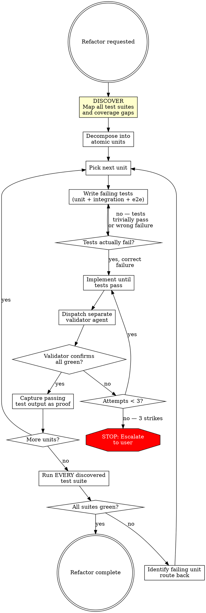

# Rigorous Refactor

## Overview

Complex refactors fail when agents skip decomposition, self-grade their work, and claim success without evidence.

**Core principle:** Every refactored unit must be independently tested and independently validated. No self-grading. No exceptions.

**Violating the letter of this process is violating the spirit of this process.**

**Layer:** Operational (method constraint). Prevents self-grading, skipping decomposition, and implementing without tests.

**REQUIRED SUB-SKILLS** (declared in `needs` frontmatter):
- `superpowers:test-driven-development` — governs the RED-GREEN cycle within each unit
- `superpowers:verification-before-completion` — governs proof-of-completion claims

## The Iron Law

```
NO IMPLEMENTATION WITHOUT DECOMPOSITION. NO COMPLETION WITHOUT INDEPENDENT VALIDATION.
```

## The State Machine



## Phase 0: Discover Test Infrastructure

Before decomposing or writing any code, **map the project's entire test landscape.** This produces a written inventory that governs all subsequent phases.

### Test Suite Discovery

Search the project for ALL test suites — not just the default test command. Dispatch a research subagent to:

1. **Scan package.json / Makefile / CI config** for all test-related scripts and commands (e.g., `test`, `test:unit`, `test:integration`, `test:e2e`, `test:smoke`, `test:demo`)
2. **Search for test config files** — jest.config, vitest.config, playwright.config, cypress.config, pytest.ini, .mocharc, etc. Each config may define a separate test suite.
3. **Search for test directories** — `__tests__/`, `test/`, `tests/`, `e2e/`, `integration/`, `spec/`, `smoke/`, etc.
4. **Identify test runners** — Different suites may use different runners (Jest for unit, Playwright for e2e, custom scripts for smoke tests).

**Produce a written test inventory.** For each discovered suite, record the category, command, and location:

| Category | What it validates |
|----------|-------------------|
| **Unit** | Individual functions/modules in isolation |
| **Integration** | Component interactions with real dependencies |
| **End-to-end** | Complete user workflows through the running application |
| **Smoke / sanity** | Critical paths still work (often a post-deploy gate) |
| **Project-specific** | Anything else the team relies on — demos, visual regression, contract tests, performance |

The agent must search for ALL categories — not just the ones with obvious names. Many projects have suites behind non-standard commands or in unexpected directories.

Running the default test command and calling it the "full suite" is a test discovery failure. The inventory must be complete before proceeding.

### Test Audit

For each file changed in the refactor, perform a three-way assessment. The output is a written action plan that governs test work in Phase 2.

| Action | When | What to look for |
|--------|------|------------------|
| **Update** | Existing tests reference changed code but now test outdated behavior | Imports of renamed/moved exports, assertions against old return values, mocks of removed interfaces |
| **Add** | Changed or new code has no test coverage | Exported functions/classes with no corresponding test cases, new branches/error paths untested |
| **Remove** | Tests validate behavior that was intentionally eliminated | Tests for deleted functions, tests asserting removed side effects, tests for deprecated API surfaces |

**How to discover this:**

1. **Map test-to-source relationships:** For each changed file, find all test files that import or reference it. These are candidates for **update** or **remove**.
2. **Find coverage gaps:** For each exported function/class in changed files, search for test cases that exercise it. Exports with no test cases are candidates for **add**.
3. **Tool-enhanced analysis (when available):** If the project has a coverage tool configured, run it against the changed files. Report line/branch coverage for refactored code. If no tool exists and a lightweight one can be added without disruption, propose it to the user.

**Produce a written test action plan:**
```
UPDATE: test/auth.test.ts — references old streamSse(), now event-stream.ts
ADD:    src/lib/event-stream.ts — 3 exported functions, 0 test files reference them
REMOVE: test/legacy-polling.test.ts — tests removed polling behavior
OK:     src/features/chat/store.ts — 4/4 exports covered by test/store.test.ts
```

This plan feeds directly into Phase 1 decomposition — each unit inherits its test actions.

Skipped the audit? You don't know what's broken, what's missing, or what's dead. Go back.

## Phase 1: Decompose

Break the refactor into atomic, independently testable units BEFORE touching any implementation code. Use the test inventory and test action plan from Phase 0.

**Each unit must be:**
- Small enough to test in isolation
- Independent enough to implement without completing other units
- Defined by behavioral boundaries, not file boundaries
- **Annotated with which test suites apply** (from Phase 0 inventory)
- **Annotated with test actions** — which tests to update, add, or remove (from Phase 0 audit)

Started coding before finishing decomposition? Stop. Delete the code. Finish the plan.

## Phase 2: Per-Unit Cycle

For each atomic unit, follow this loop:

1. **Execute test actions from Phase 0 audit** — Update broken tests, add missing tests, remove obsolete tests. New tests follow `superpowers:test-driven-development`. Cover all applicable suites (unit, integration, e2e) from the Phase 0 inventory.
2. **Verify RED** — Run tests. New tests MUST fail. Updated tests should fail against unrefactored code. If they pass, you're testing the wrong thing or the test is trivial. Fix the test.
3. **Implement** — Write minimal code to make tests pass.
4. **Independent validation** — Dispatch a SEPARATE agent (Agent tool) to run the tests and verify. The implementer MUST NOT validate their own work.
5. **If still failing after 3 attempts** — STOP. Escalate to user with evidence of what you tried.
6. **Capture proof** — Unit is ONLY complete when you have captured, verified test output. Follow `superpowers:verification-before-completion`.

## Phase 3: Integration Pass

After all units pass individually, run **every test suite from the Phase 0 inventory** — not just the default test command. Each suite runs independently with its own captured output.

| What to run | Why |
|-------------|-----|
| Unit tests | Baseline — catches regressions in individual functions |
| Integration tests | Catches broken contracts between components |
| E2e / smoke tests | Catches broken user-facing workflows |
| Demo / other suites | Project-specific validation the team relies on |

If any suite fails, route back to the responsible unit and re-enter the per-unit cycle. A refactor is not complete until ALL suites are green — not just the ones you know about from running `npm test`.

## Sub-Skill Loading

This skill references sub-skills listed in `needs`. Do not preload them.
Load each when you reach the phase that invokes it. Release focus on a
sub-skill's rules when you leave that phase. Depth limit: 3 layers
(governance -> operational -> technique). Beyond that, use judgment.

## Common Rationalizations

| Excuse | Reality |
|--------|---------|
| "I'll decompose as I go" | Emergent plans miss cross-cutting concerns. Decompose first. |
| "Existing tests are the contract" | Existing tests may be shallow. Write tests for what SHOULD work, not just what DID. |
| "Red confirmation doesn't apply to refactors" | Refactors change implementation. Tests must prove they catch the delta. |
| "Tests ARE the separate validator" | Tests validate behavior. A separate agent validates you ran them honestly. No self-grading. |
| "I should be able to figure this out" | Grinding past 3 attempts wastes context. Escalate. |
| "User doesn't need to see test output" | Proof is non-negotiable. Captured output or it didn't happen. |
| "Full suite after every unit is slow" | Full suite at integration phase. Per-unit tests after each unit. Both are required. |
| "Last few handlers follow the same pattern" | The last 20% is where bugs hide. Same rigor, every unit. |
| "E2e tests are a whole project" | Match test type to risk. High-risk paths need e2e. Agent decides scope per unit. |
| "Hard tests can wait for a follow-up" | Hard-to-test code is hard-to-verify code. If you can't test it, you can't ship it. |
| "Spinning up a validator agent is overhead" | 30 seconds of overhead vs. shipping a silent regression. Not optional. |
| "This unit is trivial, skip validation" | Trivial units take trivial time to validate. Skip nothing. |
| "893 tests pass — we're good" | Which 893? From which suites? If you only ran `npm test`, you missed everything else. |
| "The default test command runs everything" | It almost never does. Projects have unit, integration, e2e, smoke, demo suites behind different commands. Discover them. |
| "Coverage analysis is out of scope" | If you don't know what's untested, you don't know what's unverified. Best-effort analysis takes minutes. |
| "The code reviewer checked for quality" | Code review catches style and logic issues. It doesn't catch missing test coverage for changed code. Both are required. |
| "Existing tests still compile, so they're fine" | Compiling isn't passing. Tests referencing changed interfaces may pass with wrong behavior or test dead code. Audit them. |
| "I'll clean up obsolete tests later" | Dead tests are false confidence. They inflate pass counts while testing nothing. Remove them now. |

## Red Flags — STOP and Correct

- Implementation before decomposition is complete
- Tests that pass before implementation (trivial or wrong target)
- Same agent that implemented also validates
- "Tests pass" without captured output
- More than 3 implementation attempts without escalating
- Skipping tests because "it's just a refactor"
- Rushing final units because "they follow the same pattern"
- Skipping e2e for high-risk paths because "it's too much setup"
- Claiming a unit is done without running tests since last code change
- "I'll write that hard test later"
- Running only the default test command without discovering all test suites
- No test inventory produced before decomposition
- No test audit (update/add/remove) of changed files
- Validator ran "full suite" but only executed one test runner

**Any of these mean: STOP. Return to the correct phase of the state machine.**

## Quick Reference

| Phase | Gate | Evidence Required |
|-------|------|-------------------|
| **Discover** | All test suites mapped, test audit complete | Written test inventory + test action plan (update/add/remove) |
| **Decompose** | All units defined with test strategy per unit | Written unit list referencing discovered suites |
| **RED** | Tests fail correctly | Captured failing test output |
| **GREEN** | Tests pass | Captured passing output from SEPARATE validator agent |
| **Escalate** | 3 failed attempts | Evidence of each attempt |
| **Integration** | EVERY discovered suite green | Captured output per suite (not just default command) |
| **Complete** | All gates passed | All captured evidence available for review |
